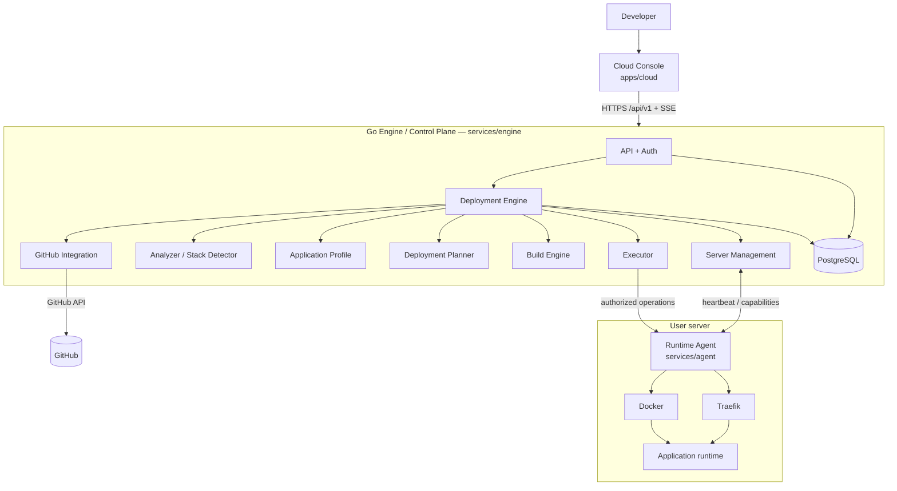
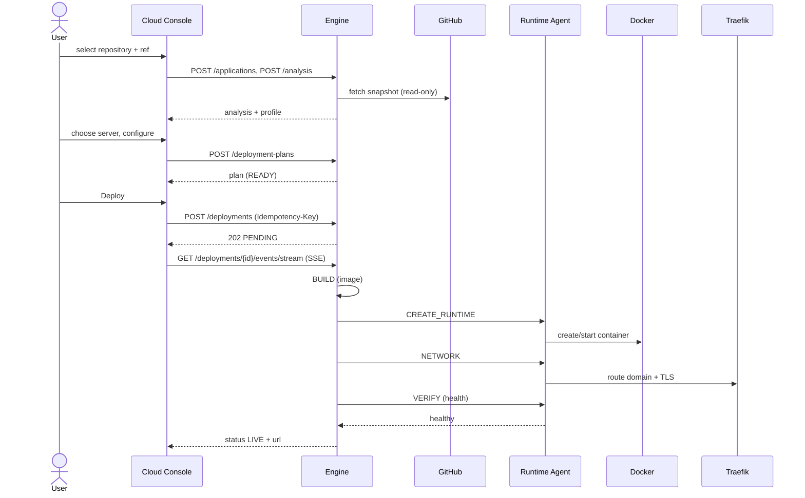

# Axiom Architecture Overview

> Issue #29. Boundaries: [`boundaries.md`](boundaries.md). API: [`api-contract.md`](api-contract.md). Decisions: [`../adr/`](../adr/README.md).

Axiom is a deployment platform organized around a control plane (Engine), a Deployment Engine inside it, and bounded Runtime Agents on user servers.

## 1. Components

Status reflects the repository on 2026-10-07: **implemented** (working code + tests), **partial** (skeleton/in-memory/stubbed), **planned** (no code).

| Component | Responsibility | Location | Status |
|---|---|---|---|
| Cloud Console | user interface; talks only to Engine API | `apps/cloud` | partial (Vite/React bootstrap) |
| Go Engine / Control Plane | HTTP API `/api/v1`, auth, config, persistence, SSE | `services/engine/cmd/engine`, `internal/api`, `internal/httpserver`, `internal/config` | partial (subset of endpoints) |
| Deployment Engine | deployment state machine, stage sequencing, events | `services/engine/internal/deployment`, `internal/executor` | partial |
| Repository Analyzer / Stack Detector | read-only detection with evidence/confidence | `services/engine/internal/analyzer`, `internal/profile` | partial |
| Deployment Planner | deterministic plan from profile + server | `services/engine/internal/planner` | partial |
| Build / Execution | build workspace, image build, execution orchestration | `services/engine/internal/build`, `internal/executor` | partial |
| Server management | server records, eligibility | `services/engine/internal/server` | partial |
| PostgreSQL | durable state: applications, deployments, events, idempotency | `services/engine/internal/database`, `migrations` | implemented (core) |
| Go Runtime Agent | registration, heartbeat, bounded operations, adapters | `services/agent` | partial (local runtime stub) |
| Docker | application runtime on the server | via Agent adapter (#83) | planned |
| Traefik | routing, domains, TLS on the server | via Agent adapter (#84) | planned |
| Redis / NATS | queue/bus **only where required** — not in V0.1 unless an ADR accepts it | — | not planned |
| Observability | structured logs, correlation IDs, metrics | `services/engine/internal/logger` | partial ([ADR-0006](../adr/0006-observability-standards.md)) |
| Expert framework (generic orchestrator) | development/governance coordination | `services/orchestrator` | implemented; superseded for deployments ([ADR-0010](../adr/0010-deployment-engine-supersedes-orchestrator.md)) |

## 2. Component & Dependency Diagram

## 3. Runtime Interaction — GitHub → LIVE

## 4. Dependency Rules

1. **Direction:** Console → Engine → (GitHub, PostgreSQL, Runtime Agent) → (Docker, Traefik). No reverse dependency.
2. **No cycles:** the Runtime Agent never calls the Console; the Console never calls the Agent; experts never call each other.
3. **Deployment Engine is the canonical orchestration boundary**: only it sequences stages and writes deployment state.
4. **Runtime Agent is bounded execution**: closed set of typed operations, no shell, no orchestration decisions.
5. **UI decoupling:** the Console never talks to Docker, Traefik, Agents, servers or the database.
6. **Contracts over imports:** services share `schemas/**` and the API contract, never Go packages.
7. **Agent connectivity:** the Agent initiates the connection to the Engine ([ADR-0008](../adr/0008-agent-engine-communication.md), proposed).

## 5. Future Architecture

MicroVM isolation, service networking, additional providers and advanced orchestration require an ADR and contract update before becoming requirements.
