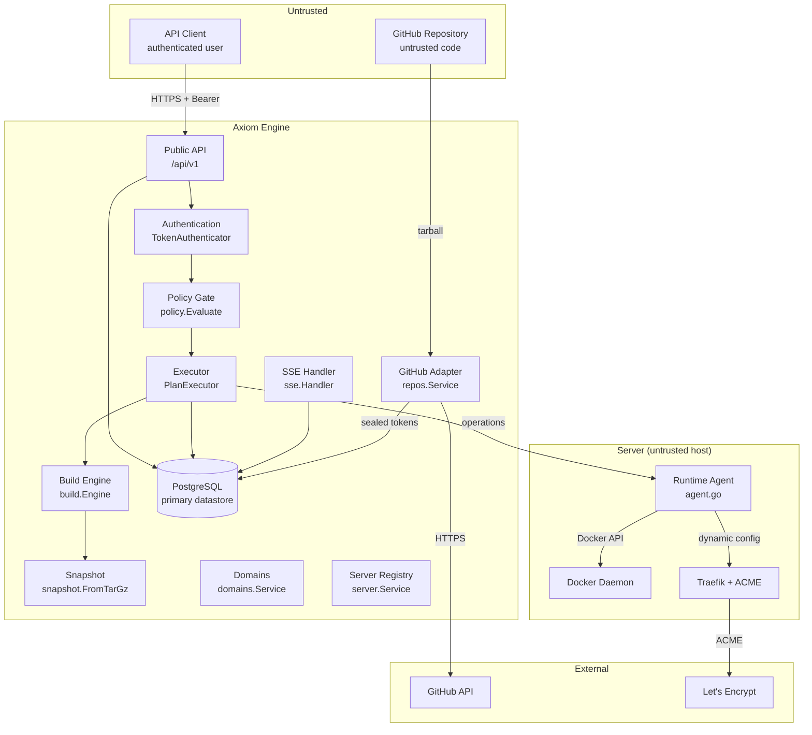

# Axiom Security Threat Model

> Issue #129. DRAFT — finalizes after #88/#89.
>
> Objective: document and test the security boundary for untrusted repositories, Agents and deployment requests.
>
> Status: **DRAFT**. This document will be finalized after issues #88 (transport hardening) and #89 (agent authorization) are resolved.

## 1. Scope

This threat model covers the Axiom V0.1 security boundary:

- **Untrusted repositories**: code fetched from GitHub that is analyzed, built and deployed.
- **Untrusted agents**: Runtime Agents on servers that execute operations dispatched by the Engine.
- **Deployment requests**: API requests from authenticated users to deploy applications.
- **Secrets**: GitHub tokens, agent credentials, API tokens, database credentials.

Out of scope (V0.1): billing, Kubernetes, multi-cloud orchestration, GitLab, advanced autonomous AI operations, marketplace, arbitrary remote shell, full organization/RBAC model (API contract §24).

## 2. Assets

| Asset | Description | Location |
|---|---|---|
| GitHub tokens | OAuth access/refresh tokens for repository access | `github_connections` table, AES-256-GCM sealed (`AXIOM_SECRET_KEY`) |
| Agent credentials | Bearer credentials for agent ↔ Engine authentication | `agent_identities` table, stored as SHA-256 hashes |
| API tokens | Interim bearer token for `/api/v1` authentication | Engine configuration (`AXIOM_API_TOKEN`) |
| Database credentials | PostgreSQL connection string | Engine configuration (`DATABASE_URL`) |
| Deployment plans | Immutable, single-use deployment plans with fingerprints | `deployment_plans` table |
| Application profiles | Detected stack configuration, may contain file paths | `application_profiles` table |
| Build artifacts | Container images with deployment metadata | Docker registry (`axiom-local`) |
| Deployment events | Ordered event log per deployment | `deployment_events` table |
| Logs | Redacted deployment logs | `deployment_logs` table |

## 3. Trust boundaries

### 3.1 Boundary descriptions

| Boundary | Trust relationship | Mechanism |
|---|---|---|
| API client → Engine | User is authenticated, resources are scoped | Bearer token (`AXIOM_API_TOKEN`), application-scoped ownership checks (404 for foreign resources) |
| Engine → GitHub | Engine presents user's sealed OAuth token | AES-256-GCM sealed tokens, PKCE S256, single-use state bound to browser |
| Engine → Agent | Engine authorizes every operation; agent re-validates | Closed operation set, deterministic operation IDs, server identity binding |
| Agent → Docker/Traefik | Agent has server-local root access | Agent runs on the server; no remote shell |
| Repository → Engine | Repository code is never executed during analysis | Read-only snapshot, no symlinks, path traversal rejection |
| Repository → Build | Build runs in ephemeral 0700 workspace | Extracted (not executed) sources, minimal environment for builder |

## 4. STRIDE threat analysis

### 4.1 Public API surface

| Threat | STRIDE | Description | Mitigation | Status |
|---|---|---|---|---|
| Unauthorized API access | Spoofing | Attacker sends requests without valid bearer token | `TokenAuthenticator` with constant-time SHA-256 comparison; `denyAll` fail-closed when no authenticator configured | Implemented (`internal/api/middleware.go`) |
| Token replay | Repudiation | Attacker replays a captured bearer token | Interim static token (#125 will replace with user sessions); token never logged | Implemented (interim) |
| Cross-tenant access | Tampering | Attacker accesses another user's applications/deployments | `ownedApplication` / `loadDeployment` return 404 for foreign resources (no existence leak) | Implemented (`internal/api/handlers.go`) |
| Request body abuse | Tampering | Attacker sends oversized or malformed JSON | 1 MiB body limit, strict JSON decoding, unknown field rejection | Implemented (`internal/api/http.go`) |
| Secret leakage in errors | Information disclosure | Attacker extracts internal details from error messages | 5xx errors return stable `INTERNAL_ERROR`; server-side detail logged with redaction | Implemented (`internal/api/http.go`, `internal/api/errors.go`) |
| Secret leakage in logs | Information disclosure | Attacker reads logs containing tokens or passwords | `logs.Redact` before persistence; `[REDACTED]` marker; PEM, URL creds, bearer, JSON/KV secrets | Implemented (`internal/logs/redact.go`) |
| Log secret leakage (5xx) | Information disclosure | Internal error details leaked in 5xx responses | 5xx messages replaced with stable text; detail logged redacted | Implemented (`internal/api/http.go`) |
| Idempotency key abuse | Tampering | Attacker reuses an idempotency key with different request | `Idempotency-Key` scoped per actor+operation+application; hash mismatch → 409 CONFLICT | Implemented (`internal/deployment/store.go`) |
| Rate limiting bypass | Denial of service | Attacker floods the API | GitHub rate limits normalized to 429; no general API rate limiter in V0.1 | TODO(#129) — general API rate limiting not yet implemented |
| SSE stream hijacking | Tampering | Attacker subscribes to another user's deployment events | `ownedDeployment` wrapper enforces application ownership before streaming | Implemented (`internal/api/handlers.go`) |
| SSE event injection | Tampering | Attacker injects fake events into the stream | Events are persisted in PostgreSQL; bus is only a notifier; gaps repaired from store | Implemented (`internal/api/sse/sse.go`) |

### 4.2 GitHub callback surface

| Threat | STRIDE | Description | Mitigation | Status |
|---|---|---|---|---|
| OAuth state replay | Repudiation | Attacker replays a captured `state` parameter | State is single-use (consumed atomically), expires after 10 minutes, bound to user and browser | Implemented (`internal/github/auth/service.go`) |
| Login CSRF | Spoofing | Attacker starts OAuth flow in victim's browser | Browser secret cookie (`axiom_github_oauth`, HttpOnly, SameSite=Lax, 10-min MaxAge) bound to callback | Implemented (`internal/api/github.go`) |
| PKCE bypass | Tampering | Attacker intercepts authorization code | PKCE S256 challenge; verifier sealed with state-bound AAD | Implemented (`internal/github/auth/service.go`) |
| Token leakage | Information disclosure | Attacker reads GitHub tokens from API responses | Tokens never returned by any endpoint; stored AES-256-GCM sealed; never logged | Implemented (`internal/github/auth/service.go`) |
| Token swap | Tampering | Attacker swaps ciphertext between connections | Ciphertext bound to connection ID as AAD (`github-access:<id>`) | Implemented (`internal/security/secrets/box.go`) |
| Provider error injection | Tampering | Attacker sends fake `error` parameter | `error` query parameter handled; `access_denied` → user-facing denied result | Implemented (`internal/api/github.go`) |

### 4.3 Agent endpoints surface

| Threat | STRIDE | Description | Mitigation | Status |
|---|---|---|---|---|
| Rogue agent registration | Spoofing | Attacker registers a fake agent for a server | Single-use bootstrap token (15-min TTL, bound to pending server, single redeem) | Implemented (`internal/agentauth/service.go`) |
| Agent credential replay | Repudiation | Attacker replays a captured agent credential | Nonce + timestamp freshness (5-min skew, 10-min nonce window); credentials stored as SHA-256 hashes | Implemented (`internal/agentauth/service.go`) |
| Agent credential theft | Information disclosure | Attacker reads plaintext credentials from storage | Credentials stored only as SHA-256 hashes; plaintext returned exactly once at issue/redeem | Implemented (`internal/agentauth/service.go`) |
| Operation injection | Tampering | Attacker sends forged operations to the agent | Closed operation set; unknown types rejected with `UNKNOWN_OPERATION`; server identity binding | Implemented (`services/agent/internal/protocol/protocol.go`) |
| Operation replay | Repudiation | Attacker replays a captured operation | Deterministic operation IDs (`op_<deploymentID>_<STEP>_<attempt>`); agent-side dedupe window | Implemented (`services/agent/internal/protocol/protocol.go`) |
| Server identity spoofing | Spoofing | Attacker binds agent to a different server | Bootstrap token bound to server; operation `serverId` must match agent's bound server | Implemented (`internal/agentauth/service.go`, `services/agent/internal/protocol/protocol.go`) |
| Agent impersonation | Spoofing | Attacker uses a stolen agent credential | Credential rotation with 5-min grace; revocation on server revocation; 90-day TTL | Implemented (`internal/agentauth/service.go`) |
| Transport eavesdropping | Information disclosure | Attacker reads agent ↔ Engine traffic | HTTPS transport; credential in `Authorization` header (not URL) | Implemented (HTTPS); mTLS TODO(#88) |
| Agent denial of service | Denial of service | Attacker floods agent endpoints | Agent endpoints bypass user authenticator but require valid agent credentials | Implemented; rate limiting TODO(#129) |

### 4.4 Build pipeline surface

| Threat | STRIDE | Description | Mitigation | Status |
|---|---|---|---|---|
| Build command injection | Tampering | Attacker injects shell commands via `build.command` or `startCommand` | `presets.ValidateCommand`: single line, printable ASCII ≤ 500 chars; rejects `` ` ``, `$(`, `<<`, `sudo `, `rm -rf /`, `curl `, `wget ` | Implemented (`internal/profile/presets/presets.go`) |
| Dockerfile injection | Tampering | Attacker adds malicious Dockerfile commands | Dockerfile is repository content; build runs in ephemeral workspace with minimal environment; no secrets in build context | Implemented (`internal/build/builder.go`, `internal/build/workspace/workspace.go`) |
| Source archive traversal | Tampering | Attacker includes `../` paths in tarball | `workspace.cleanPath` and `snapshot.normalize` reject absolute paths, `..` traversal, backslashes, null bytes | Implemented (`internal/build/workspace/workspace.go`, `internal/analyzer/snapshot/snapshot.go`) |
| Symlink attack | Tampering | Attacker includes symlinks to escape workspace | Symlinks, hardlinks, devices are skipped (recorded in `Skipped`, never followed) | Implemented (`internal/build/workspace/workspace.go`, `internal/analyzer/snapshot/snapshot.go`) |
| Large file DoS | Denial of service | Attacker includes huge files in repository | Limits: 200 MiB compressed, 1 GiB total, 50 000 files, 100 MiB per file (workspace); 512 KiB retained per file, 64 MiB retained total (snapshot) | Implemented (`internal/build/workspace/workspace.go`, `internal/analyzer/snapshot/snapshot.go`) |
| Secret leakage via snapshot | Information disclosure | Attacker reads secrets from repository files | `secretLike` files (`.env`, `.npmrc`, `.netrc`, `.pypirc`, `*.pem`, `*.key`, `id_rsa*`, `id_ed25519*`) are never retained in snapshot content | Implemented (`internal/analyzer/snapshot/snapshot.go`) |
| Build workspace escape | Tampering | Attacker accesses host filesystem from build | Workspace is 0700, ephemeral, unique per build; builder gets explicit minimal environment; no control-plane credentials in workspace | Implemented (`internal/build/workspace/workspace.go`, `internal/build/builder.go`) |
| Image tag injection | Tampering | Attacker injects malicious image tags | Image tags are Engine-generated (`<registry>/<slug>:<commit7>-<dep8>`); slug sanitized to lowercase alphanumeric + hyphens | Implemented (`internal/build/engine.go`) |
| Registry poisoning | Tampering | Attacker pushes malicious images to registry | Images are built by the Engine from source; registry is `axiom-local` (local Docker); no external registry in V0.1 | Implemented (local registry); external registry trust TODO(#129) |

### 4.5 Snapshot / analysis surface

| Threat | STRIDE | Description | Mitigation | Status |
|---|---|---|---|---|
| Repository code execution | Tampering | Attacker includes malicious code that runs during analysis | Analysis never executes repository code; snapshot is read-only metadata + bounded file content | Implemented (`internal/analyzer/snapshot/snapshot.go`) |
| Binary file DoS | Denial of service | Attacker includes binary files that crash the analyzer | Binary detection (null byte or invalid UTF-8 in head); binary files not retained | Implemented (`internal/analyzer/snapshot/snapshot.go`) |
| Duplicate entry abuse | Tampering | Attacker includes duplicate paths in tarball | Duplicate entries rejected as `ErrMalformed` | Implemented (`internal/analyzer/snapshot/snapshot.go`) |
| Empty archive abuse | Denial of service | Attacker submits empty archive | Empty archives rejected with `ErrEmpty` | Implemented (`internal/analyzer/snapshot/snapshot.go`) |
| Archive bomb | Denial of service | Attacker includes highly compressed archive that expands hugely | Compressed byte limit (200 MiB) enforced during read; uncompressed total limit (1 GiB) | Implemented (`internal/analyzer/snapshot/snapshot.go`) |
| Analysis timeout abuse | Denial of service | Attacker triggers long-running analysis | 2-minute analysis timeout | Implemented (`internal/analysis/service.go`) |

### 4.6 Docker / Traefik on server surface

| Threat | STRIDE | Description | Mitigation | Status |
|---|---|---|---|---|
| Container escape | Tampering | Attacked application escapes container | Docker container isolation; no privileged mode in V0.1; TODO(#129) — seccomp/AppArmor profiles not yet enforced |
| Port conflict abuse | Denial of service | Attacker deploys app on conflicting port | Host port mapping is agent-managed; conflicts surface as `RUNTIME_FAILED` | Implemented (detection); prevention TODO(#129) |
| Traefik config injection | Tampering | Attacker modifies Traefik routing | Traefik configured only by agent's network adapter; Engine stores routing intent, agent applies it | Implemented (agent-scoped); unrestricted Traefik config forbidden (API contract §22) |
| Certificate private key theft | Information disclosure | Attacker reads Let's Encrypt private keys | Keys managed by Traefik on server; Engine never handles certificates | Implemented (agent-scoped) |
| DNS hijacking | Tampering | Attacker changes DNS to point domain elsewhere | `CheckDNS` verifies resolution matches server address; mismatch reported | Implemented (`internal/domains/verify.go`) |
| Domain/hostname abuse | Tampering | Attacker registers hostname for another application | Hostnames globally unique; `EnsureDomain` rejects unregistered hostnames for planning; ownership verified per application | Implemented (`internal/domains/domains.go`) |
| SSRF via repository URLs | Tampering | Attacker provides repository URL pointing to internal services | Repository URLs come from GitHub API (trusted source); archive fetched from GitHub codeload; no arbitrary URL fetching | Implemented (GitHub-only); SSRF via health paths TODO(#129) |
| SSRF via health check paths | Tampering | Attacker sets health path to internal URL | Health path is validated to start with `/`; probe is executed by agent against the deployed application, not arbitrary URLs | Implemented (path validation); full SSRF test TODO(#129) |

### 4.7 Secrets surface

| Threat | STRIDE | Description | Mitigation | Status |
|---|---|---|---|---|
| GitHub token theft at rest | Information disclosure | Attacker reads tokens from database | AES-256-GCM sealed with `AXIOM_SECRET_KEY`; bound to connection ID as AAD | Implemented (`internal/security/secrets/box.go`) |
| GitHub token theft in transit | Information disclosure | Attacker reads tokens from logs or API responses | Tokens never logged; never returned by API; `AccessToken` is the only export path | Implemented (`internal/github/auth/service.go`) |
| Agent credential theft | Information disclosure | Attacker reads agent credentials from database | Stored as SHA-256 hashes; plaintext returned once; rotation with grace | Implemented (`internal/agentauth/service.go`) |
| API token theft | Information disclosure | Attacker reads `AXIOM_API_TOKEN` from logs | Token never logged; validated at startup; required in production | Implemented (`internal/config/config.go`) |
| Database credential theft | Information disclosure | Attacker reads `DATABASE_URL` from logs | Never logged; validated at startup | Implemented (`internal/config/config.go`) |
| Secret values in plans | Information disclosure | Attacker embeds secrets in deployment plan | `policy.scanSecrets` rejects plans matching password/token/bearer/private-key patterns | Implemented (`internal/policy/policy.go`) |
| Secret values in logs | Information disclosure | Attacker reads secrets from deployment logs | `logs.Redact` runs before persistence; PEM, URL creds, bearer, JSON/KV secrets replaced with `[REDACTED]` | Implemented (`internal/logs/redact.go`) |
| Secret values in events | Information disclosure | Attacker reads secrets from SSE events | Event payloads must remain free of secrets (API contract §23); health body truncated to 4096 bytes | Implemented (API contract §23, `internal/health/health.go`) |
| Secret values in error messages | Information disclosure | Attacker reads secrets from 5xx error details | 5xx messages replaced with stable `INTERNAL_ERROR`; detail logged redacted | Implemented (`internal/api/http.go`) |

## 5. Accepted risks

| Risk | Rationale | Mitigation plan |
|---|---|---|
| No general API rate limiting | V0.1 has a single static API token; rate limiting is a platform concern | TODO(#129) — implement per-token or per-IP rate limiting |
| No mTLS for agent transport | Transport hardening tracked by #88 | TODO(#88) — add mTLS or request signing |
| No seccomp/AppArmor for containers | V0.1 relies on Docker default isolation | TODO(#129) — enforce seccomp/AppArmor profiles |
| No external registry trust policy | V0.1 uses local Docker registry only | TODO(#129) — define image trust policy for external registries |
| Agent runs as root on server | Agent needs Docker and Traefik access | TODO(#129) — run agent with least privilege |
| Analysis has 2-minute timeout | Prevents infinite analysis but may fail on huge repositories | Monitor and tune |
| Build has 20-minute timeout | Prevents infinite builds but may fail on huge contexts | Monitor and tune |

## 6. Abuse test coverage

| Surface | Test | Status |
|---|---|---|
| Public API | Authentication required for all `/api/v1` endpoints | Implemented (`internal/api/middleware.go`) |
| Public API | Foreign resources return 404 (no existence leak) | Implemented (`internal/api/handlers.go`) |
| Public API | Request body size limit (1 MiB) | Implemented (`internal/api/http.go`) |
| Public API | Unknown fields rejected | Implemented (`internal/api/http.go`) |
| GitHub callback | Single-use state | Implemented (`internal/github/auth/service.go`) |
| GitHub callback | Browser cookie binding | Implemented (`internal/api/github.go`) |
| Agent endpoints | Bootstrap token single-use | Implemented (`internal/agentauth/service.go`) |
| Agent endpoints | Credential replay protection | Implemented (`internal/agentauth/service.go`) |
| Agent endpoints | Server identity binding | Implemented (`services/agent/internal/protocol/protocol.go`) |
| Build pipeline | Command injection rejected | Implemented (`internal/profile/presets/presets.go`) |
| Build pipeline | Path traversal rejected | Implemented (`internal/build/workspace/workspace.go`) |
| Build pipeline | Symlinks skipped | Implemented (`internal/build/workspace/workspace.go`) |
| Build pipeline | Size limits enforced | Implemented (`internal/build/workspace/workspace.go`) |
| Snapshot | Secret-like files not retained | Implemented (`internal/analyzer/snapshot/snapshot.go`) |
| Snapshot | Binary files not retained | Implemented (`internal/analyzer/snapshot/snapshot.go`) |
| Secrets | Tokens sealed at rest | Implemented (`internal/security/secrets/box.go`) |
| Secrets | Logs redacted before persistence | Implemented (`internal/logs/redact.go`) |
| Secrets | Plans with secrets rejected | Implemented (`internal/policy/policy.go`) |
| SSRF | Repository URLs from GitHub only | Implemented (GitHub adapter) |
| SSRF | Health paths validated | Implemented (`internal/planner/validation/validation.go`) |
| Domain abuse | Hostnames globally unique | Implemented (`internal/domains/domains.go`) |
| Domain abuse | Unregistered hostnames rejected for planning | Implemented (`internal/domains/domains.go`) |

## 7. TODOs

| Issue | Description |
|---|---|
| #88 | Transport hardening (mTLS, request signing) for agent ↔ Engine |
| #89 | Agent authorization (re-validate authorization before execution) |
| #129 | Finalize this threat model after #88/#89; add general API rate limiting; add container isolation profiles; add external registry trust policy; add SSRF abuse tests |

## 8. Related documentation

- `docs/architecture/api-contract.md` — API contract, security boundary (§22)
- `docs/architecture/deployment-policy.md` — Deployment security boundary, gates, policy rules
- `docs/architecture/agent-protocol.md` — Agent ↔ Engine protocol, security mapping (§10)
- `docs/adr/0005-traefik-reverse-proxy.md` — Traefik as reverse proxy with ACME
- `docs/operations/runbook.md` — Operational failure matrix and runbook
